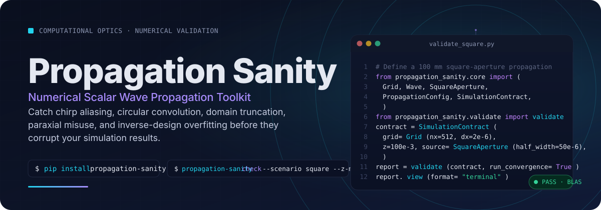
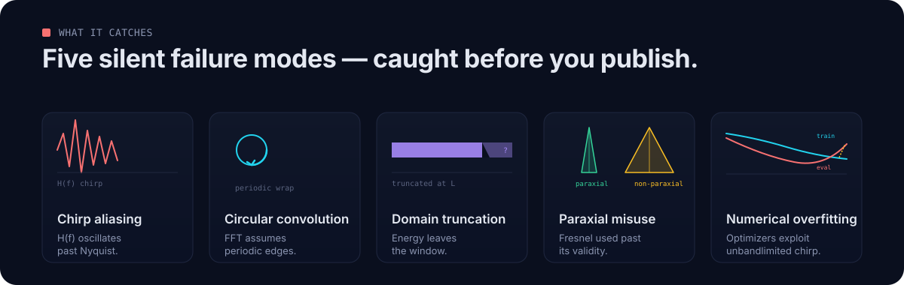
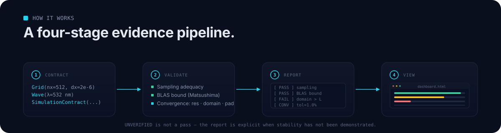

# Propagation Sanity

<p align="center">
  
</p>

> **Primary disclaimer**
>
> **This toolkit does not prove physical correctness.** It produces evidence about numerical stability, sampling adequacy, and known discretization risks inside the tested scalar propagation model. Read every `FAIL`, `UNVERIFIED`, and `OUT_OF_SCOPE` the same way you would read a CI log: as the absence of a guarantee, not its presence.

---

## The problem in one paragraph

In computational optics, scalar diffraction simulations — the Angular Spectrum Method, band-limited ASM, Fresnel, Rayleigh–Sommerfeld direct integration — drive metasurface design, holography, beam shaping, and differentiable optical networks. They also fail silently. A transfer function can oscillate faster than Nyquist without warning. FFT boundaries can wrap energy around the window. Diffracted lobes can leave the domain. Optimizers can settle into unbandlimited artifacts that produce a beautiful training loss and a useless device.

**Propagation Sanity is an evidence-oriented validator for exactly these failure modes.** It classifies each check, runs convergence experiments when a re-sampleable source is available, and reports a structured verdict — not a handwave.

---

## Quickstart

### Install

```bash
pip install propagation-sanity
```

### Validate one scenario from the CLI

```bash
# Quick terminal summary
propagation-sanity check --scenario square --z-mm 100

# Full validation + convergence + interactive HTML dashboard
propagation-sanity check --scenario square --z-mm 100 --convergence --html dashboard.html
```

### Use the Python API directly

```python
from propagation_sanity.core import (
    Grid, Wave, SquareAperture, PropagationConfig, PropagationMethod, SimulationContract,
)
from propagation_sanity.validate import validate
from propagation_sanity.core.report import ValidationReport

contract = SimulationContract(
    grid=Grid(nx=512, ny=512, dx=2e-6, dy=2e-6),
    wave=Wave(wavelength=532e-9),
    z=100e-3,                                       # 100 mm propagation
    propagation_config=PropagationConfig(method=PropagationMethod.ASM, bandlimit=False),
    source=SquareAperture(half_width=50e-6),
    characteristic_size=100e-6,
)

report = validate(contract, run_convergence=True)

print(report.summary())               # terminal box-drawn report
report.save("validation_report.json")  # structured JSON
report.save_html("validation_dashboard.html")
report.view(format="terminal")        # or format="html", open_browser=True

# Reload any saved report
loaded = ValidationReport.load("validation_report.json")
```

---

## Five silent failure modes — caught before you publish

<p align="center">
  
</p>

| # | Mode | What goes wrong | Toolkit signal |
|---|---|---|---|
| 1 | **Chirp aliasing** | ASM transfer function oscillates faster than the spatial Nyquist rate | `FORMAL_CRITERION` (Matsushima 2009) → `PASS` / `FAIL` |
| 2 | **Circular convolution** | FFT assumes periodic boundaries; without zero-padding, diffracted energy wraps | `FORMAL_CRITERION` padding bound + `CROSS_REFERENCE` |
| 3 | **Domain truncation** | Non-compact beams or wide lobes truncate against the window edge | `DIAGNOSTIC` boundary energy + `CONVERGENCE` over $L$ |
| 4 | **Paraxial misuse** | Fresnel approximation used outside its validity domain | `CROSS_REFERENCE` ASM vs. Fresnel vs. Direct Integration |
| 5 | **Numerical overfitting** | Inverse-design optimizers exploit unbandlimited chirp artifacts | Cross-eval under an independent verified forward model |

---

## Why evidence, not assertion

The toolkit does not guess whether a simulation is "fine". Each check is **typed** by the kind of evidence it can produce, and each output status is restricted to the outcomes that type actually supports:

| Assessment type | Meaning | Allowed outputs |
|---|---|---|
| `DERIVED` | Exact relations ($L = N\Delta x$, $\Delta f = 1/L$, $f_N = 1/(2\Delta x)$) | `INFO` |
| `DIAGNOSTIC` | Informative risk indicators (spectral edge energy, boundary energy, phase step) | `INFO` |
| `FORMAL_CRITERION` | Literature-derived mathematical bounds (Matsushima 2009 admissible band) | `PASS` / `FAIL` |
| `CONVERGENCE` | Refinement experiments (resolution, domain, padding) | `CONVERGED_AT_TOLERANCE` / `NOT_CONVERGED` / `UNVERIFIED` |
| `CROSS_REFERENCE` | Comparison against an independent baseline (DI, analytic, BLAS) | `AGREES_AT_TOLERANCE` / `DISAGREES` |
| `SCOPE_CHECK` | Configuration exceeds scalar domain (e.g. evanescent dominance) | `INFO` / `OUT_OF_SCOPE` |

> **`UNVERIFIED` is not a pass.** It means the toolkit did not have a re-sampleable `FieldSource` to run refinement experiments, or convergence execution was disabled. Treat it as "stability has not been demonstrated at the requested tolerance", not "all good."

---

## How it works

<p align="center">
  
</p>

1. **Contract** — declare `Grid`, `Wave`, source, propagation config, and a characteristic size.
2. **Validate** — sampling adequacy, Matsushima BLAS bound, domain containment, and convergence over resolution / domain / padding.
3. **Report** — structured `ValidationReport` with typed checks, verdicts, and literature citations.
4. **View** — terminal box-drawn report, or a self-contained Notion-style HTML dashboard with drag-and-drop JSON reload.

---

## Examples & benchmarks

### 1 · Square aperture regression

Re-evaluates the classical square-aperture case ($N = 512$, $\Delta x = 2\,\mu\text{m}$, $\lambda = 532\,\text{nm}$, $a = 100\,\mu\text{m}$) across $z \in \{1, 10, 100, 150\}\,\text{mm}$:

```bash
propagation-sanity benchmark --scenario square
```

- At $z = 1\,\text{mm}$: standard ASM and BLAS match to **< 0.01 %**.
- At $z = 150\,\text{mm}$: standard ASM suffers severe chirp aliasing (**> 28 %** discrepancy); the Matsushima formal criterion flags `FAIL`.

### 2 · Self-accelerating Airy beam

Demonstrates non-compact field handling where physical-domain convergence requires field regeneration, not just zero-padding:

```bash
propagation-sanity benchmark --scenario airy
```

### 3 · Numerical overfitting in differentiable optics

Optimizes a phase element under a numerically weak propagator (unbandlimited ASM at large $z$) versus a validated propagator (BLAS). Re-evaluating both designs under an independent verified forward model proves that the weakly trained design suffers severe numerical overfitting.

See `examples/03_differentiable_optics_overfitting.ipynb` for the full reproduction.

---

## Reporting & visualization layer

The `propagation_sanity.viewer` layer is intentionally a **separate aesthetic** from this README — a minimalist Notion-style reader for calm report inspection:

- **Self-contained HTML dashboard.** Single HTML file with embedded report JSON and pure SVG/CSS components. No external server. Drag any `*.json` report into the window to visualize it client-side.
- **Notion-style properties block.** Status badge, propagator method, $z$, $\lambda$, resolution, $L$, Fresnel number $N_F$.
- **Executive callout.** Numerical health summary with actionable physical warnings.
- **Convergence progression bars.** Minimalist step bars comparing intensity relative error across grid resolutions, physical domains, and FFT padding against the 1.0 % tolerance threshold.
- **Spectral support vs. Matsushima limit.** Ruler-style spectrum diagram showing the 99 % field-energy boundary relative to the Matsushima admissible bandlimit $f_{\text{limit}}$ and the Nyquist frequency $f_{\text{Nyq}}$.
- **Toggle list checklist.** Collapsible Notion-style `▶ / ▼` list of all checks with formula blocks, assumptions, physical interpretation, and literature citations.
- **Light / dark mode.** Classic Notion white paper `#ffffff` and Notion dark `#191919`.
- **Formatted terminal viewer.** Unicode box drawing (`┌─┐`, `│`, `└─┘`), ANSI status indicators (`[ PASS ]`, `[ FAIL ]`, `[ CONVERGED ]`, `[ INFO ]`), and automatic TTY detection with plain-text fallback.

---

## What it can validate

- **Sampling adequacy** — whether $\Delta x$ and $\Delta f$ adequately capture the input field and transfer function.
- **Matsushima BLAS sampling bounds** — whether ASM chirp oscillations exceed the aliasing-free bound.
- **Physical-domain containment** — whether energy leaks into domain edges or diffracted lobes exceed the computation window.
- **Numerical convergence** — whether results stabilize under grid refinement (resolution), window enlargement (domain), or FFT padding (algorithmic).
- **Model validity indicator** — discrepancy between ASM and the Fresnel paraxial approximation.

## What it cannot validate

- **Vector / Maxwell physics** — polarization, near-field evanescent coupling, high-NA vector effects.
- **Inhomogeneous media** — complex index distributions (FDTD / BPM scope).
- **Experimental reality** — fabricated device aberrations, laser coherence length limits, detector noise.

---

## Backends & adapters

- **`WavepropAdapter` (`backend="waveprop"`)** — production-ready CPU / NumPy adapter supporting ASM, band-limited ASM (BLAS), single-step Fresnel, Fraunhofer, and Rayleigh–Sommerfeld direct integration (DI and FFT-DI).
- **`TorchOpticsAdapter` (`backend="torchoptics"`)** — PyTorch-native differentiable optics adapter cleanly decoupling field geometry (`Field`, `PlanarGrid`, `shape`, `spacing`) from propagation settings (`propagation_method`, `asm_pad`, output resampling). Supports ASM, DIM (impulse-response convolution), Fresnel variants, Voelz critical-distance automatic regime switching, and autograd gradient flow for inverse design.

---

## Repository layout

```text
propagation-sanity/
├── src/propagation_sanity/   core, validate, viewer, backends
├── tests/                     property-based and reference benchmarks
├── examples/                  01 square · 02 airy · 03 overfitting · 04 mitigation
├── docs/                      design notes: check-spec, metrics, library boundaries
├── assets/readme/             hero, failure-modes, pipeline
├── pyproject.toml
└── README.md
```

---

## References

1. **K. Matsushima, T. Shimobaba.** *Band-Limited Angular Spectrum Method for Numerical Simulation of Free-Space Propagation in Far and Near Fields.* Optics Express **17**, 19662–19673 (2009). [DOI: 10.1364/OE.17.019662](https://doi.org/10.1364/OE.17.019662)
2. **F. Shen, A. Wang.** *Fast-Fourier-transform based numerical integration method for the Rayleigh–Sommerfeld diffraction formula.* Applied Optics **45**, 1102–1110 (2006). [DOI: 10.1364/AO.45.001102](https://doi.org/10.1364/AO.45.001102)
3. **D. Voelz, M. Roggemann.** *Digital simulation of scalar optical diffraction: revisiting chirp function sampling criteria and consequences.* Applied Optics **48**, 6132–6142 (2009). [DOI: 10.1364/AO.48.006132](https://doi.org/10.1364/AO.48.006132)

---

## License

MIT. See `pyproject.toml`.
